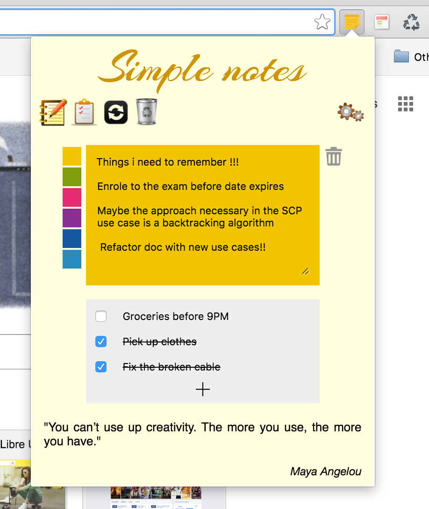

###Simple notes is a lightweight chrome extension to store ideas and to-do lists inside the browser and keep them handy.

Persistence is done using chrome storage Appi which is asynchronous by nature so the way persistence is implemented provides a good example and learning exercise for anyone interested in learning more about callbacks, promises and Sync/Async programming overall.
	

Work in progress, i highly appreciate any collaboration or input

Agustin

 
>“Very often, gleams of light come in a few minutes' sleeplessness, in a second
>perhaps; you must fix them. To entrust them to the relaxed brain is like writing on water; there is every chance that on the morrow there will be no slightest trace left of any happening.”  <cite>Antonin Sertillanges</cite> 
